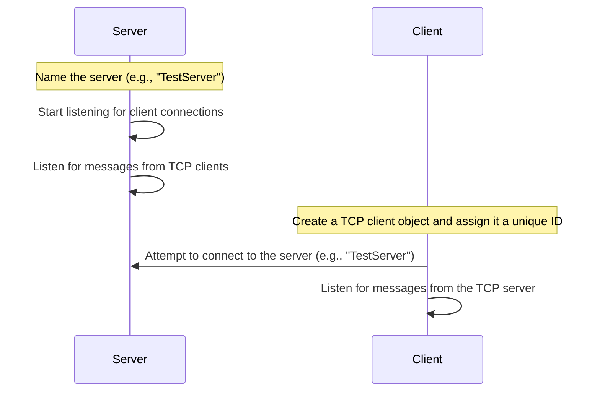
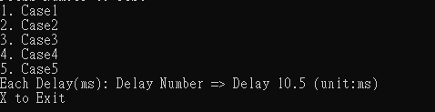

# Internal Process Communication with TCP
Github: https://github.com/Jasson-Chou/InternalProcessCommunication-TCP

### **Overview**

This project demonstrates using local TCP to communicate between multiple processes/instances on the same host. It includes a lightweight IPC library `IPCLib` (with `TCPServer`, `TCPClient`, AES encryption, etc.) and a sample application `InternalProcessCommunicationWithTCPDemo` for testing and measuring communication performance and correctness.

**Project Structure**

- `IPCLib`: Core library providing `TCPServer`, `TCPClient`, and related utilities (e.g. `AesEncryption`, `IPCKeywords`).
- `InternalProcessCommunicationWithTCPDemo`: Sample application containing several test cases (Case1~Case5) to exercise different communication flows and performance measurements.

---

### **Requirements**

- .NET Framework 4.7.2
- C#7.3

---

### **Build & Run**

1. Open the solution `InternalProcessCommunicationWithTCP.sln` in Visual Studio.
2. Set the startup project to `InternalProcessCommunicationWithTCPDemo`.
3. Build and run.

When the program starts it creates a TCP server (using an available port) and starts multiple sample clients. Use the console interface to choose different test cases.

---

### **Server and Client connection handling**

**Server**

1. Name the server (e.g., `"TestServer"`)
2. Start listening for client connections
3. Listen for messages from TCP clients

**Client**

1. Create a TCP client object and assign it a unique ID
2. Attempt to connect to the server (e.g., `"TestServer"`)
3. Listen for messages from the TCP server

---

### **Test Cases**

- Case1: Server sends string -> Client reads (single RTT measurement).
- Case2: Client sends string -> Server reads (single RTT measurement).
- Case3: Server -> Client -> Server (round-trip) measuring full cycle time.
- Case4: Client -> Server -> Client (round-trip) measuring full cycle time.
- Case5: Multiple clients run concurrently for parallel testing of latency and averages.

Each case runs multiple iterations (default `TestCount =4096`) and logs per-iteration durations into CSV files placed under the `TestDatas` folder (default filenames `CaseN.csv`).

---

### **Usage Examples**

After running the program, options for selecting test cases will be displayed. Once selected, execution will begin.

select case 1 ~ 5

After running Case 1, the execution progress will be displayed above, and the total execution time will be printed upon completion.

example case.1

---

### **Console Interface**

- After launch the console shows options and settings:
- Input `1`~`5` to run the corresponding case.
- Set `Delay` in milliseconds using the format e.g. `Delay10.5` to add a specified pause between iterations.
- Case5 accepts a client count parameter (range1~100 by default, controlled by `maxClient`).

---

### **Output Files**

- Test results are written to a `TestDatas` folder under the working directory. Files are named `Case1.csv`, `Case2.csv`, etc., containing per-iteration durations (microseconds) and total duration statistics.

---

### **Notes & Best Practices**

- The sample uses blocking read/write and simple synchronization (with some use of `Parallel.For`) to simulate communication. For production use consider asynchronous IO, robust error handling, and connection retry logic to improve resilience.
- High values for `TestCount` or client count may saturate system resources—adjust according to your machine.
- To communicate between different hosts, ensure firewall and port configuration allow connections.

---

### **Extensions / Suggestions**

- Add more comprehensive error handling and logging in `IPCLib`.
- Convert synchronous tests to asynchronous `async/await` flows to measure real async behavior.
- Expose configurable ports and encryption options, and add unit tests to validate communication correctness.

---

### **Trouble shooting**

- The first test has a chance of failure; currently actively searching for the issue
- ~~Currently the Progressbar positioning in the Console is abnormal; please ignore this issue for now~~